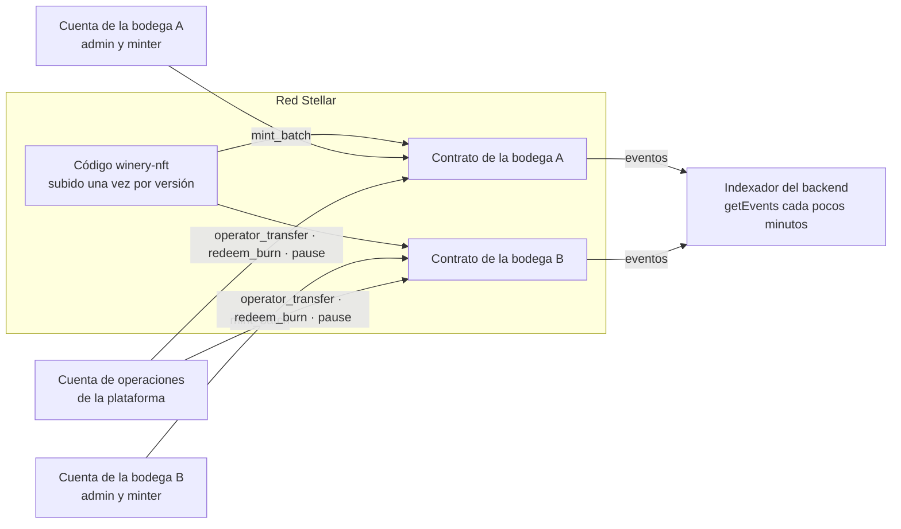
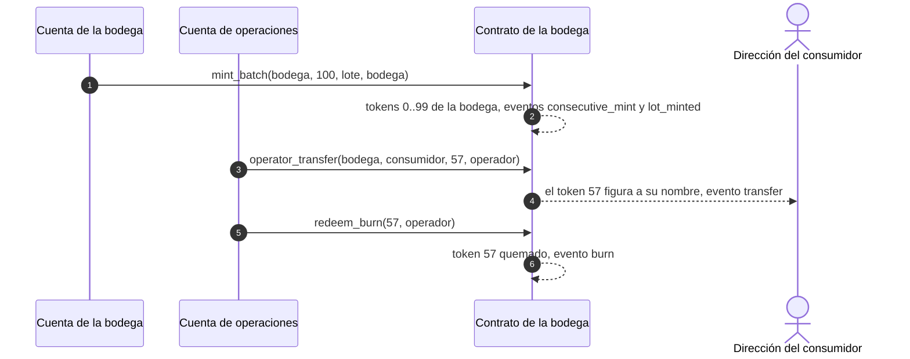

# Arquitectura

> Versión 1 · 27-09-2026. Resume `docs-back/06-tokens-billeteras-y-cadena.md` (§2, §3, §5, §8, §10) desde el punto de vista de este repositorio. Detalle de cada función en [funciones.md](funciones.md), decisiones de implementación en [decisiones.md](decisiones.md) y costes en [costes.md](costes.md).

## Qué hay en la red

Solo tres cosas (doc 06 §0): el **NFT de cada botella** (este repositorio), la **identidad de cada bodega** (su cuenta y su contrato) y el **hash del expediente de cada lote** (una transacción clásica con `memo`, doc 06 §6, que **no** es un contrato y no vive aquí). Pedidos, pases, canjes, precios y reglas viven en la base de datos del backend.

## Un contrato por bodega



- El **código** (`winery_nft.wasm`) se sube una vez por versión; cada bodega es una **instancia** con su constructor (`scripts/desplegar-bodega.sh`; desplegadas en testnet, ver [testnet.md](testnet.md)).
- La **bodega** es la administradora y la emisora: aparece como origen de sus NFT (A-02). Su clave la custodia el backend (doc 06 §8).
- La **plataforma** es la operadora: entrega al comprador y quema al canjear. Las direcciones de los consumidores son `G…` custodiales derivadas (SEP-0005) y **sin fondear** (A-28): nunca firman; el contrato no les pide nada.
- Todas las comisiones las paga la cuenta de operaciones (o la de despliegue).
- Un incidente o una pausa afecta solo a una bodega (doc 06 §3.3).

## Ciclo de un NFT



Si un lote es canjeable, si un pase está activo o si una ventana venció se decide en la base de datos, no aquí (doc 06 §5 y §7).

## Composición del contrato

| Pieza | Origen | Notas |
|---|---|---|
| NFT *Consecutive* | `stellar-tokens` 0.7.2 | Emisión en lote barata: guarda el dueño solo en el último id del lote y lo infiere hacia atrás |
| Control de acceso | `stellar-access` 0.7.2 | Admin único con transferencia en dos pasos y roles (`minter`, `operator`) |
| Pausa | `stellar-contract-utils` 0.7.2 | Bloquea emisión, entregas, quemas y transferencias estándar |
| `mint_batch`, `operator_transfer`, `redeem_burn`, `set_token_uri_base`, `total_minted`, reglas de pausa, `renounce_admin` desactivado | **Propio** (`contracts/winery-nft/src/contract.rs`) | La única parte sin auditar: corta, con pruebas de cada rama de autorización; revisión externa en B.4 |

## Estructura del repositorio

```
Cargo.toml                 espacio de trabajo y versiones fijadas
rust-toolchain.toml        Rust 1.98.1 + wasm32v1-none
contracts/winery-nft/      el contrato
  src/contract.rs          funciones
  src/events.rs            eventos propios
  src/errors.rs            errores propios (3000+)
  src/test.rs              pruebas unitarias (nativas)
  src/test_wasm.rs         pruebas sobre el WASM compilado + informe de costes
scripts/verificar.sh       puertas locales (= CI)
scripts/docker.sh          cualquier script en Docker (Windows): Rust, stellar-cli, jq
scripts/cuentas-testnet.sh cuentas de testnet (Friendbot) en `stellar keys`
scripts/secretos-github.sh claves de testnet → secretos de GitHub Actions (por tubería)
scripts/desplegar-bodega.sh  subida del código y contrato de una bodega (idempotente)
scripts/ida-y-vuelta.sh    emitir, entregar, quemar, eventos y costes reales
scripts/testnet.sh         despliegue + ida y vuelta de todas las bodegas (workflow «Testnet»)
scripts/lib/red.sh         funciones comunes de red (RPC, costes, firmas por papel)
deployments/testnet.json   direcciones públicas por red
docs/                      esta documentación
.github/workflows/ci.yml   CI
.github/workflows/testnet.yml  despliegue e ida y vuelta en testnet (manual)
```

## Red y versiones

- **Testnet** en desarrollo y staging, **mainnet** en producción tras la revisión externa (B.4). El script de despliegue rechaza mainnet sin confirmación explícita.
- Protocolo vigente verificado por el doc 06 §10: 27. `soroban-sdk 26.1.1` genera contratos válidos para él.
- El indexador lee eventos con Stellar RPC (`getEvents`, ≈ 7 días de retención); Horizon no se usa.
